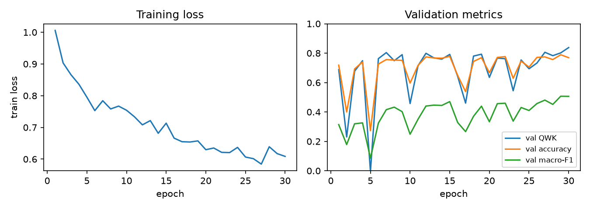
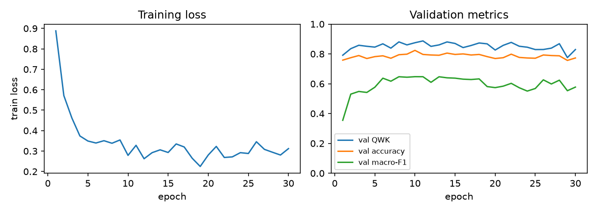
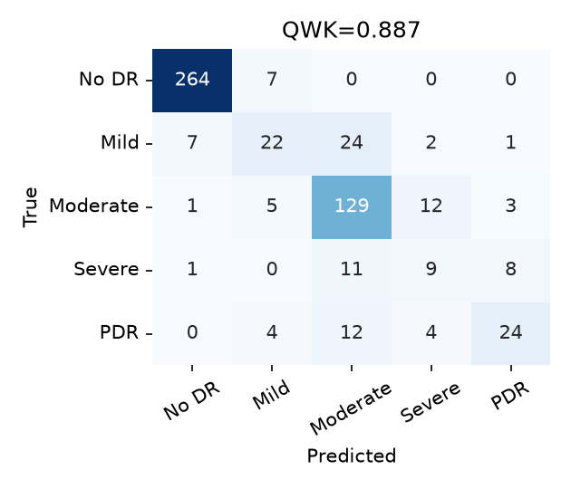

# Reproducing Diabetic Retinopathy Grading on APTOS 2019

A research-reproduction study of **Chilukoti et al., "A reliable diabetic retinopathy grading via transfer learning and ensemble learning with quadratic weighted kappa metric"**, *BMC Medical Informatics and Decision Making* 24:37 (2024). The paper fine-tunes an EfficientNet-B3 with CLAHE + Gaussian-blur preprocessing and a snapshot ensemble, reporting **QWK 0.954** on APTOS 2019 (ImageNet init) and **0.967** (EyePACS init + ensemble).

This repository covers **Stage 2** (base-paper selection and reproducibility checklist) and **Stage 3** (baseline reproduction) of a CV course project on five-class DR grading. The paper has no public code, so the method was re-implemented from the text.

**Team:** Shivansh, Divyanshi, Vivek, Shubham

**Report:** [`Stage2_3_Report.pdf`](Stage2_3_Report.pdf) (IEEE format, 5 pages)

> This is a reproduction study. No clinical claims are made.

## Results

Test set: 550 images (stratified 70/15/15 split, seed 42). Minority recall is the mean recall of Severe NPDR and PDR.

| Configuration | Prediction | QWK | Accuracy | Macro-F1 | Macro AUC | Severe recall | PDR recall |
|---|---|---|---|---|---|---|---|
| Paper hyper-parameters (lr 1e-3) | single model | 0.827 | 0.771 | 0.473 | 0.897 | 0.00 | 0.30 |
| Paper hyper-parameters (lr 1e-3) | 10-snapshot vote | 0.788 | 0.767 | 0.412 | 0.913 | 0.00 | 0.00 |
| Only change: lr 1e-4 | single model (best val) | **0.887** | 0.815 | **0.630** | 0.894 | **0.31** | 0.55 |
| Only change: lr 1e-4 | 10-snapshot vote | **0.887** | **0.822** | 0.613 | **0.930** | 0.10 | **0.59** |
| *Paper (reported)* | | *0.954 / 0.967* | | | | | |

### Key findings

1. **Reproduction gap of about 0.13 QWK** with the paper's stated hyper-parameters (0.827 vs 0.954).
2. **Training at lr 1e-3 is unstable.** Validation QWK repeatedly collapses (down to −0.006 at epoch 5) and recovers.
3. **The snapshot ensemble hurts under unstable training** (0.827 → 0.788). Only the final snapshot is strong, so the majority vote is dominated by weaker models.
4. **QWK and accuracy hide minority-grade failure.** With the paper's settings, Severe NPDR is never predicted (recall 0.00 in every snapshot), yet QWK stays near 0.83 because most errors are one grade off.
5. **Changing only the learning rate to 1e-4** stabilises training, raises QWK to 0.887, raises minority recall from 0.15 to 0.43, and halves predictions that are off by two or more grades (48 → 24). This closes about half of the gap.
6. **APTOS contains 123 groups of byte-identical images**, 30 of which carry conflicting grades. Under a random split, 29 test images have a copy in the training set, but excluding them changes QWK by only about 0.001, so leakage does not explain the gap.

<p align="center">
  
  
  <br><em>Training loss and validation metrics. Left: paper hyper-parameters (lr 1e-3). Right: lr 1e-4.</em>
</p>

<p align="center">
  
  
  <br><em>Test confusion matrices. Left: lr 1e-3 (Severe never predicted). Right: lr 1e-4.</em>
</p>

## Method (as reproduced)

| Component | Setting |
|---|---|
| Backbone | EfficientNet-B3, ImageNet-pretrained (`timm`), fully fine-tuned |
| Head | FC(1536→512), Dropout 0.5, ReLU, FC(512→512), Dropout 0.25, ReLU, FC(512→5) |
| Preprocessing | CLAHE on LAB luminance (clip 2.0, 8×8 tiles), 5×5 Gaussian blur, square resize, ImageNet normalisation |
| Optimiser | Adam, lr 1e-3, weight decay 1e-4, global grad-norm clipping 0.1, cross-entropy |
| Ensemble | Predictions from 10 evenly spaced epochs, combined by majority vote |
| Metrics | QWK (primary), accuracy, macro-F1, macro one-vs-rest AUC, per-class precision/recall/F1, confusion matrix |

### Deviations from the paper

| Paper | Here | Reason |
|---|---|---|
| 300×300 px | 224×224 px | EfficientNet-B3 at 300 px does not fit in 8 GB unified memory (Apple M2) |
| 60 epochs | 30 epochs (snapshot every 3) | ~4 min/epoch locally |
| Batch size not stated | 8 | Largest batch that avoids swapping |
| Split not stated for APTOS | Stratified 70/15/15, seed 42 | Same proportions the paper uses for EyePACS |
| EyePACS pre-training (0.967) | Not attempted | 35k images, beyond local compute |

The exact paper protocol (300 px, 60 epochs, batch 16) is one flag change. See [Running the exact protocol on Colab](#running-the-exact-protocol-on-colab).

## Repository layout

```
.
├── Stage2_3_Report.pdf              # Stage 2 + 3 report (IEEE format)
├── base paper.pdf                   # Chilukoti et al. 2024 (CC BY 4.0)
├── Diabetic Retinopathy Grading Phase 1 (1).pdf   # Stage 1 literature review
├── CV_Student_Handout_Project.docx.pdf            # Course brief
├── CV_Sample_Flow.docx.pdf                        # Course worked example
└── dr-repro/
    ├── src/
    │   ├── data.py          # split (faithful / clean), CLAHE+blur preprocessing, cached dataset
    │   ├── model.py         # EfficientNet + three-layer head
    │   ├── losses.py        # CE (paper), weighted CE, focal (for Stage 4/5)
    │   ├── metrics.py       # QWK, macro-F1, per-class metrics, AUC, confusion matrix
    │   └── train.py         # training, resumable checkpoints, snapshot ensembles
    ├── scripts/
    │   ├── prepare_data.py      # download APTOS (HF mirror) shard by shard, resize to 512 px
    │   ├── check_duplicates.py  # exact-duplicate / leakage audit
    │   ├── leakage_eval.py      # re-score a run without leaked test images
    │   ├── analyze.py           # curves, confusion matrices, failure cases
    │   ├── make_tables.py       # LaTeX tables + macros for the report
    │   ├── eval_ckpt.py         # evaluate a saved checkpoint
    │   ├── bench.py             # throughput / memory benchmark
    │   ├── run_stage3.sh        # the Stage 3 training queue
    │   └── launch.py            # start the queue detached from the shell
    ├── runs/                # per-run config, logs, split, test probabilities, results.json
    ├── results/             # figures, duplicate audit, leakage re-scoring
    ├── reports/             # LaTeX sources of the report
    ├── logs/                # raw training logs
    ├── colab_full_protocol.ipynb
    └── requirements.txt
```

## Reproducing locally

Requires Python 3.12. Tested with PyTorch 2.14 on Apple Silicon (MPS); CUDA and CPU are picked up automatically.

```bash
cd dr-repro
uv venv -p 3.12 .venv && source .venv/bin/activate   # or: python -m venv .venv
uv pip install -r requirements.txt                    # or: pip install -r requirements.txt

# 1. Data: ~9 GB download, processed one shard at a time; ~160 MB kept on disk
python scripts/prepare_data.py

# 2. Duplicate audit
python scripts/check_duplicates.py

# 3. Train (paper hyper-parameters, then the lr 1e-4 diagnostic); ~2 h each on an M2
python scripts/launch.py            # detached; or run: bash scripts/run_stage3.sh
tail -f logs/s2_faithful.log

# 4. Analysis, tables and report
python scripts/leakage_eval.py s2_faithful
python scripts/leakage_eval.py s2_lr1e4
python scripts/make_tables.py
cd reports && tectonic stage2_3_report.tex
```

A single run can also be launched directly:

```bash
python -m src.train --run my_run --size 224 --bs 8 --epochs 30 --snapshots 10 --lr 1e-3 --protocol faithful
```

Useful flags: `--protocol clean` (drops conflicting duplicates, one copy per group), `--loss {ce,wce,focal}`, `--no-clahe`, `--hflip`, `--backbone <timm name>`. Interrupted runs resume automatically from `runs/<name>/last.pt`.

## Running the exact protocol on Colab

[`dr-repro/colab_full_protocol.ipynb`](dr-repro/colab_full_protocol.ipynb) runs the paper's exact setting (300 px, 60 epochs, batch 16, lr 1e-3) plus the same setting with lr 1e-4 on a free T4 GPU ([`scripts/run_colab.sh`](dr-repro/scripts/run_colab.sh)):

1. Open the notebook in Colab ([open from GitHub](https://colab.research.google.com/github/sshivanshg/dr-grading-reproduction/blob/main/dr-repro/colab_full_protocol.ipynb)), select a T4 GPU runtime, then Run all.
2. The notebook clones this repository and keeps data, checkpoints and results in `MyDrive/DR_colab/`. After a disconnect, Run all again: finished runs are skipped and unfinished runs resume from the last epoch.
3. Results are saved to `MyDrive/DR_colab/results_colab.zip`.

## Data

[APTOS 2019 Blindness Detection](https://www.kaggle.com/competitions/aptos2019-blindness-detection): 3,662 fundus photographs graded 0 to 4 (No DR 1805, Mild 370, Moderate 999, Severe 193, PDR 295). The images are **not** included in this repository because the competition rules do not allow redistribution. `prepare_data.py` downloads them from the full-resolution Hugging Face mirror [`sngsfydy/aptos`](https://huggingface.co/datasets/sngsfydy/aptos).

## Limitations

- Single dataset, single seed, no external validation.
- 224 px and 30 epochs instead of 300 px and 60 epochs, because of local hardware.
- The EyePACS-pretrained configuration (QWK 0.967) was not reproduced.
- The test set has only 29 Severe and 44 PDR images, so per-grade recall estimates are noisy.

## Next step (Stage 4)

The stable lr 1e-4 run (QWK 0.887, Severe recall 0.31) is the baseline. Following the Stage 1 literature review, the planned single-variable hypothesis replaces cross-entropy with a class-balanced, ordinal-aware loss, with the expected effect predicted before any code is written.

## Citation

```bibtex
@article{chilukoti2024,
  author  = {Chilukoti, Sai Venkatesh and Shan, Liqun and Tida, Vijay Srinivas and Maida, Anthony S. and Hei, Xiali},
  title   = {A reliable diabetic retinopathy grading via transfer learning and ensemble learning with quadratic weighted kappa metric},
  journal = {BMC Medical Informatics and Decision Making},
  volume  = {24},
  pages   = {37},
  year    = {2024},
  doi     = {10.1186/s12911-024-02446-x}
}
```
